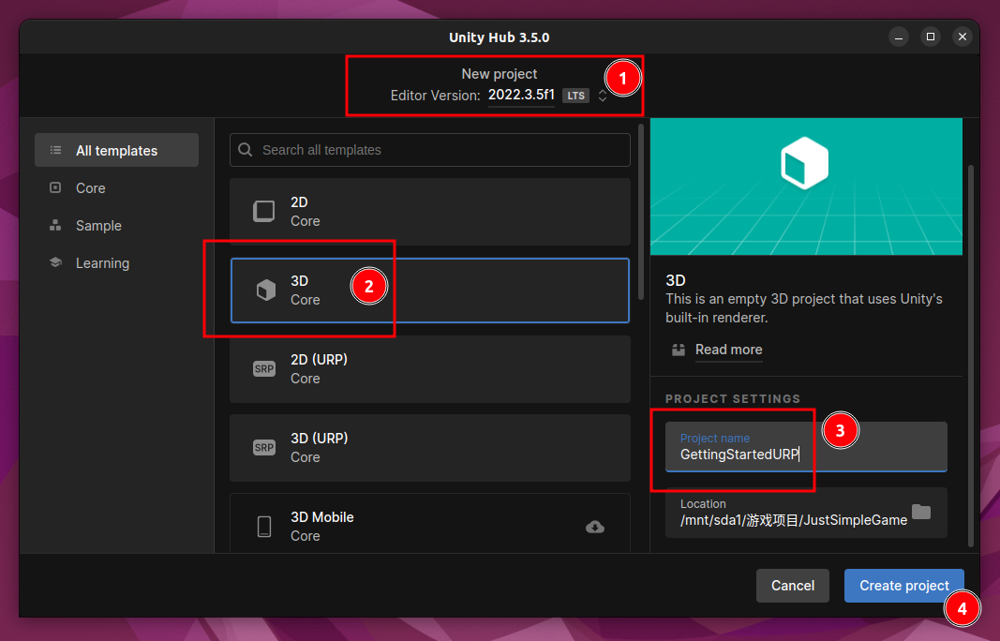
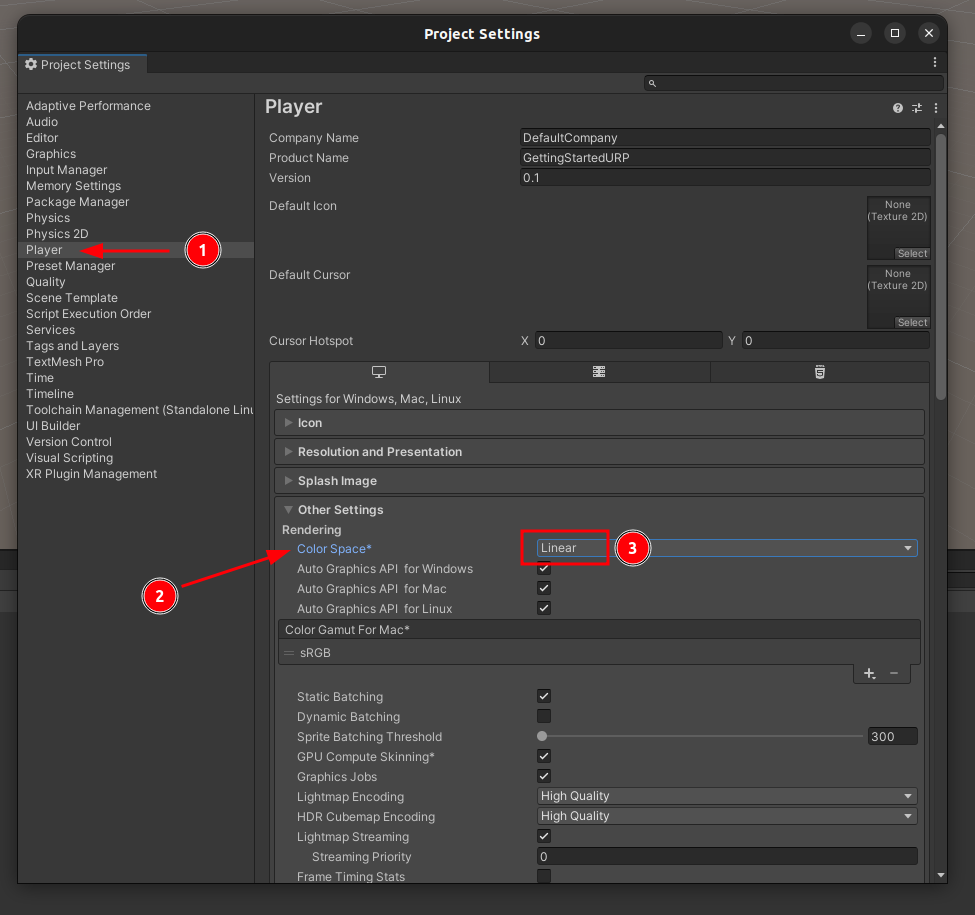
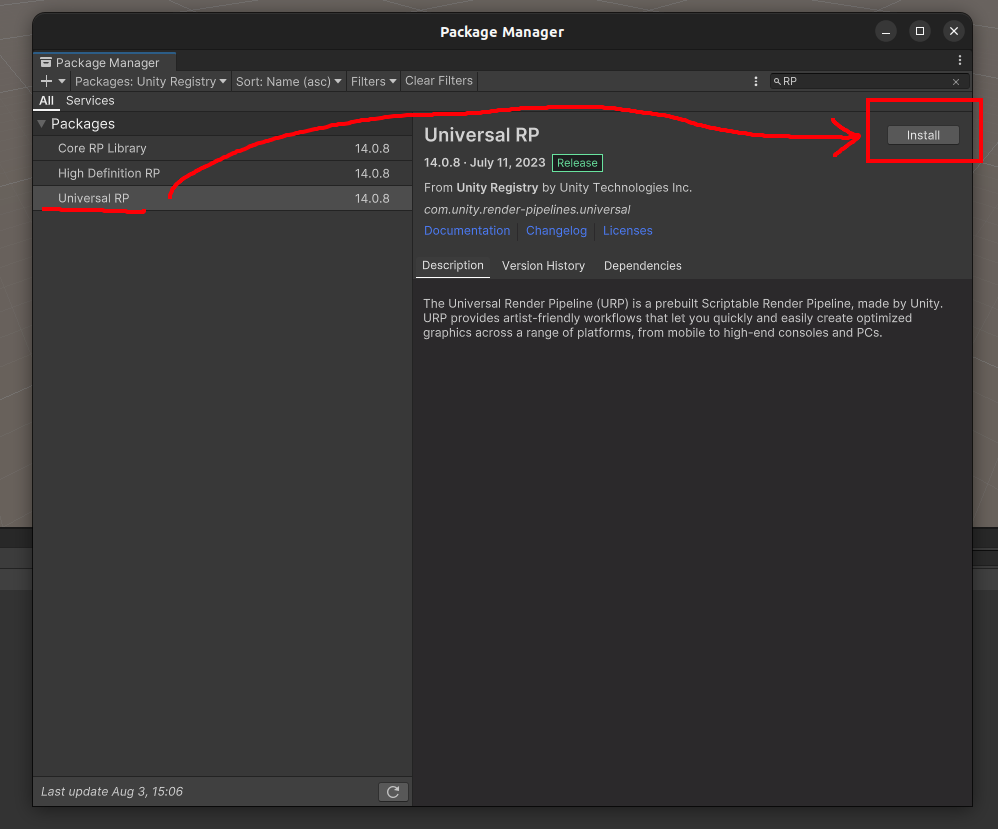

# 开始使用URP

## 升级现有的3D Core项目

### 创建项目(假设)

1. 注意启动器版本
2. 选择3D Core
3. 更改项目名称和保存路径
4. 创建项目

### 初始化设置

#### 设置颜色空间

1. 打开Edit/Project Settings
2. 在左侧选择Player
3. 在右侧的Other Settings/Rendering/Color Space中选择 Linear，以获得正确的光照

### 安装Universal RP

- 在Package Manager中安装 Universal RP

### 添加URP资产（Universal Render Pipeline Asset）

在资源文件夹中使用鼠标右键，点击：Create/Rendering/URP Asset (with Universal Render)，此时Unity会创建两个文件：

- New Universal Render Pipeline Asset
- New Universal Render Pipeline Asset_Renderer

你可以把这两个URP资产改称你想要的名字，一般一个项目会有多个URP资产，每个URP资产对应一种性能（例如性能模式、平衡模式、高保真模式等）

### 使用URP资产

打开项目设置： Edit/Project Settings，展开左侧的Graphics，然后将右侧的Scriptable Render Pipeline Settings选择为你想要设置的URP资产

